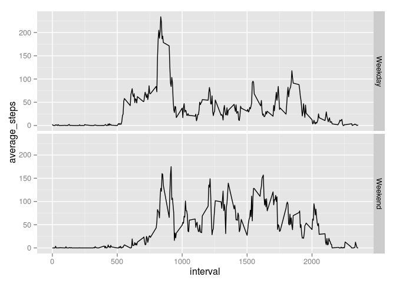

# Reproducible Research: Peer Assessment 1


## Loading and preprocessing the data
Use read.csv() to read in the step activity data. 

```r
# Read in csv file
activity_csv <- read.csv('activity.csv')

# Make steps numeric
activity_csv$steps <- as.numeric(activity_csv$steps)

# Make interval numeric
activity_csv$interval <- as.numeric(activity_csv$interval)

# Convert date from factor to date
activity_csv$date <- as.Date(activity_csv$date)

summary(activity_csv)
```

```
##      steps             date               interval     
##  Min.   :  0.00   Min.   :2012-10-01   Min.   :   0.0  
##  1st Qu.:  0.00   1st Qu.:2012-10-16   1st Qu.: 588.8  
##  Median :  0.00   Median :2012-10-31   Median :1177.5  
##  Mean   : 37.38   Mean   :2012-10-31   Mean   :1177.5  
##  3rd Qu.: 12.00   3rd Qu.:2012-11-15   3rd Qu.:1766.2  
##  Max.   :806.00   Max.   :2012-11-30   Max.   :2355.0  
##  NA's   :2304
```

## What is mean total number of steps taken per day?
The mean for the total number of steps per day is calculated with the following code.

```r
library(plyr)
# Get the steps per day
steps_per_day_df <- ddply(activity_csv,.(date), summarize, steps_per_day=sum(steps, na.rm=TRUE))

# Generate the historgram
hist(steps_per_day_df$steps_per_day)
```

 

```r
# Mean of the total number of steps per day
mean(steps_per_day_df$steps_per_day, na.rm=TRUE)
```

```
## [1] 9354.23
```

```r
# Median of the total number of steps per day
median(steps_per_day_df$steps_per_day, na.rm=TRUE)
```

```
## [1] 10395
```


## What is the average daily activity pattern?
The average daily activity pattern is calculated with the code below.

```r
# Get the average number of steps taken per 5 minute interval across all days
daily_activity_pattern_df <- ddply(activity_csv,.(interval), summarize, average_steps=mean(steps, na.rm=TRUE))

# Make the time series plot
plot(daily_activity_pattern_df$interval, daily_activity_pattern_df$average_steps, type='l')
```

 

The 5-minute interval with the maximum number of steps is calculated below.

```r
# Find the 5-minute interval on average across all the days that contains the maximum number of steps
daily_activity_pattern_df[which.max(daily_activity_pattern_df$average_steps), ]
```

```
##     interval average_steps
## 104      835      206.1698
```

## Imputing missing values
Missing values are replaced by the mean value for the corresponding interval across all days.

```r
# Get the number of missing values in the data set
sum(colSums(is.na(activity_csv)))
```

```
## [1] 2304
```

```r
# Fill in missing data using mean for that interval
na_indices <- which(is.na(activity_csv$steps))

# Make a copy of the activity.csv data frame
activity_csv_filled <- activity_csv

for (index in na_indices) {
  activity_csv_filled[index, 'steps'] <- subset(daily_activity_pattern_df, interval == activity_csv[index, 'interval'])$average_steps
}

# Get the steps per day for the filled in data
steps_per_day_df <- ddply(activity_csv_filled,.(date), summarize, steps_per_day=sum(steps))

# Generate a historgram for the filled in data
hist(steps_per_day_df$steps_per_day)
```

 

```r
# Mean of the total number of steps per day for the filled in data
mean(steps_per_day_df$steps_per_day)
```

```
## [1] 10766.19
```

```r
# Median of the total number of steps per day for the filled in data
median(steps_per_day_df$steps_per_day)
```

```
## [1] 10766.19
```

The mean and median are higher than the original data. Inputting missing data increases the estimated total daily number of steps.

## Are there differences in activity patterns between weekdays and weekends?
The following code helps determine the differences in activity patterns between weekend and weekdays.

```r
# Determine if a day is a weekend or weekday
dayType <- function(day) { 
  if (is.element(day, c("Saturday", "Sunday"))) {
    return("Weekend")  
  }
  # Assume other inputs are weekdays
  else {
    return("Weekday")
  }
  return("Not a date")
}

# Add a new variable indicating whether the date is a weekday or weekend
activity_csv$daytype <- as.factor(sapply(weekdays(activity_csv$date), dayType))

# Get the average number of steps taken per 5 minute interval across all days
daily_activity_pattern_df <- ddply(activity_csv,.(daytype, interval), summarize, average_steps=mean(steps, na.rm=TRUE))

library(ggplot2)

# Make the time series plot
ggplot(daily_activity_pattern_df, aes(interval,average_steps),  type='l') + geom_line() +  facet_grid(daytype ~ .)
```

 
